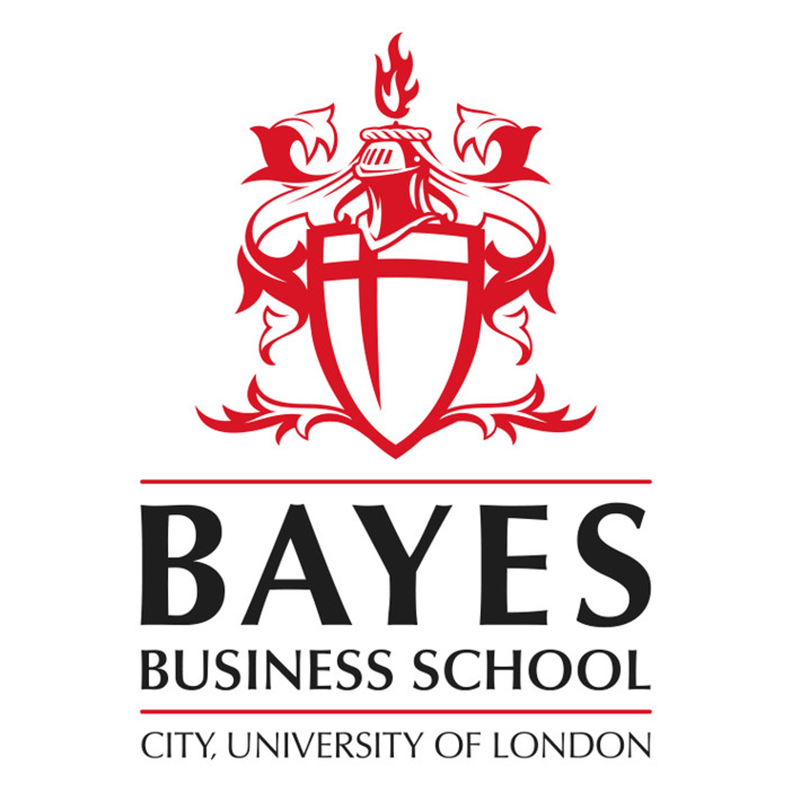

# Applied Research Proejct - Abarth Electrification
 

This is the GitHub repository for my contribution to the Applied Research Project (ARP) - Abarth 1.

The ARP is part of the requirements for the award of the MSc Business Analytics at Bayes Business School in 2022/23 academic year.

** This repository is forked from my branch of the collaboration repo ([/XShawn1/Bayes_ARP_Abarth_1](https://github.com/XShawn1/Bayes_ARP_Abarth_1/tree/main)), and is reorganized for display purpose. 

## Project Aim
- To understand the online discussion on Abarth before and after launching their first electric vehicle (Abarth 500e)
- To propose business insights and identify risks & opportunities based on the analysis result

## Code Explanation
- Scraped Reddit discussions under subreddit /abarth and /fiat with keyword search 'abarth'
- Performed topic modelling to extract topic clusters and keywords
- Performed sentiment analysis on each topic
- Performed comparison across time, particularly around Announcement, Public Showcase, and Market Release
